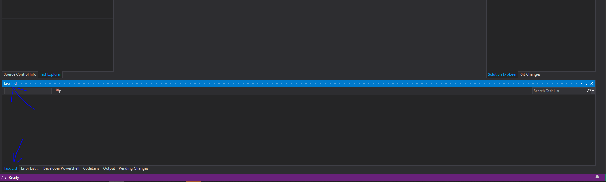
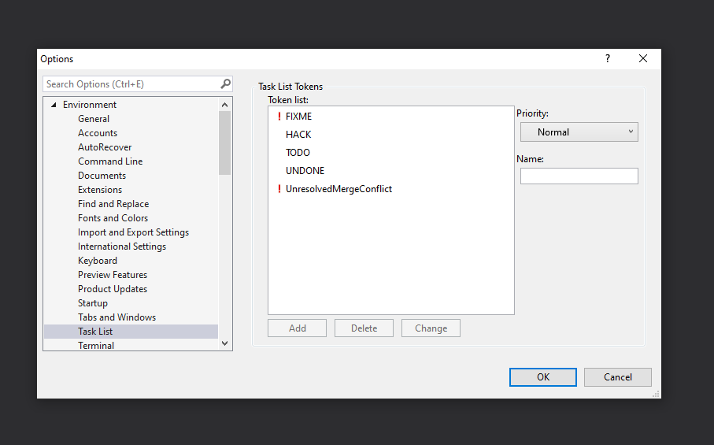

# Visual Studio Code
Maybe the best and more complete IDE.

## Index
- [.. IDE's](../README.md)
- [Download](#download)
- [Tools](#tools)
  - [Task list](#tools-tasklist)

## Download 
- [For Windows](https://visualstudio.microsoft.com/vs/)
- [For mac](https://visualstudio.microsoft.com/thank-you-downloading-visual-studio-mac/?sku=communitymac&rel=16)

### Tools 

#### Task list 
A tool to show all your tags TODOs, FIXMEs, etc.

**Open window**

`Menu` > `View` > `Task List`

**Add support to tag FIXME**
1. `Menu` > `Tools` > `Options` > `Envirnment` > `Task List`
2. Choose the tag name and priority
2. Button `Add`

> [Equivalence in visual studio code](./VisualStudioCode.md#extensions-tasklist)