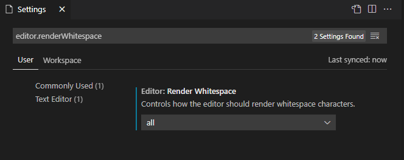

# Visual Studio Code
Open source IDE supported by Microsoft very fast and with support for a lot extensions.

## Index
- [.. IDE's](../README.md)
- [Download](#download)
- [Extensions](#extensions)
  - [GitHub Actions](#extensions-github-actions)
  - [Docker](#extensions-github-docker)
  - [Task list](#extensions-tasklist)
- [Tips](#tips)
  - [Show whitespaces](#tips-show-whitespaces)
- [HotKeys (Shortcuts)](#hotkeys)
  - [Edit](#hotkeys-edit)
  - [List](#hotkeys-list)

## Download 
[Download](https://code.visualstudio.com/)

### Extensions 

#### GitHub Actions 
Extension with IntelliSense code and very good to management GitHub Actions.

[Download](https://marketplace.visualstudio.com/items?itemName=cschleiden.vscode-github-actions)

#### Docker 
The Docker extension makes it easy to build, manage, and deploy containerized applications from Visual Studio Code. It also provides one-click debugging of Node.js, Python, and .NET Core inside a container.
You can get IntelliSense when editing your Dockerfile and docker-compose.yml files, with completions and syntax help for common commands.

[Download](https://marketplace.visualstudio.com/items?itemName=ms-azuretools.vscode-docker)

#### Task List 
A extensions to show all your tags TODOs, FIXMEs, etc.
- [Todo Tree](https://marketplace.visualstudio.com/items?itemName=Gruntfuggly.todo-tree)
- [TODO Highlight](https://marketplace.visualstudio.com/items?itemName=wayou.vscode-todo-highlight)
> [Equivalence in visual studio](./VisualStudio.md#tools-tasklist)

### Tips 

#### Show whitespaces 

This tip it's very useful to when you are create yaml files or programming python to see the code indentation

1. Go Settings
2. Search the configuration: `editor.renderWhitespace`
3. change to **All**

### Hotkeys (Shortcuts)

#### Edit 
`Menu` > `File` > `Preferences` > `Keyboard Shortcuts`

#### List 

**Comments**
- `Ctrl` + `K` `Ctrl` + `C` : Add line comment (editor.action.addCommentLine)
- `Ctrl` + `K` `Ctrl` + `U` : Remove line comment (editor.action.removeCommentLine)

**Capitalization**
- `Ctrl` + `Shift` + `U` : Transform to uppercase (editor.action.transformToUppercase) _Modified by me_
- `Ctrl` + `U` : Transform to lowercase (editor.action.transformToLowercase) _Modified by me_