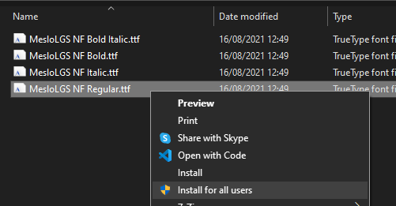

# Windows Terminal
Windows terminal is a new Microsoft open source CLI with support to multiple terminals like a command prompt, PowerShell, git CLI, Azure Cloud Shell, etc...


## Index
- [.. Tools](./README.md)
- [Donwload](#donwload)
- [Git customization](#gitcustomization)
- [Windows terminal customization](#customization)


## Donwload <a name="donwload"></a>
[Official](https://docs.microsoft.com/en-us/windows/terminal/get-started)


## Git customization <a name="gitcustomization"></a>

**Install git support**
```bash
Install-Module posh-git -Scope CurrentUser -Force
```

**Install support for themes**
```bash
Install-Module oh-my-posh -Scope CurrentUser
```

**Edit profile**
```bash
code $PROFILE
```

**Load modules and theme. Add next code in end of file**
```bash
Import-Module posh-git
Import-Module oh-my-posh
Set-PoshPrompt -Theme slimfat
```

**Install font to support theme icons**

[Download](https://github.com/romkatv/dotfiles-public/tree/master/.local/share/fonts/NerdFonts)

Install the fronts for all users


## Windows terminal customization <a name="customization"></a>

Settings > Open JSON file
```json
"profiles":
{
  "defaults":
  {
    "acrylicOpacity": 0.89,
    "colorScheme": "Dracula",
    "fontFace": "MesloLGS NF",
    "fontSize": 10,
    "useAcrylic": true
  },
    
    ...

"schemes":
[
  {
    "name": "Dracula",
    "cursorColor": "#F8F8F2",
    "selectionBackground": "#44475A",
    "background": "#282A36",
    "foreground": "#F8F8F2",
    "black": "#21222C",
    "blue": "#BD93F9",
    "cyan": "#8BE9FD",
    "green": "#50FA7B",
    "purple": "#FF79C6",
    "red": "#FF5555",
    "white": "#F8F8F2",
    "yellow": "#F1FA8C",
    "brightBlack": "#6272A4",
    "brightBlue": "#D6ACFF",
    "brightCyan": "#A4FFFF",
    "brightGreen": "#69FF94",
    "brightPurple": "#FF92DF",
    "brightRed": "#FF6E6E",
    "brightWhite": "#FFFFFF",
    "brightYellow": "#FFFFA5"
  }
],
```
[Colors scheme](https://draculatheme.com/windows-terminal)
> Original source of the tutorial [Blog Renato Groffe](https://renatogroffe.medium.com/dicas-de-visual-studio-code-integra%C3%A7%C3%A3o-com-git-via-terminal-e-kubernetes-templates-pt5-395819902ab7)