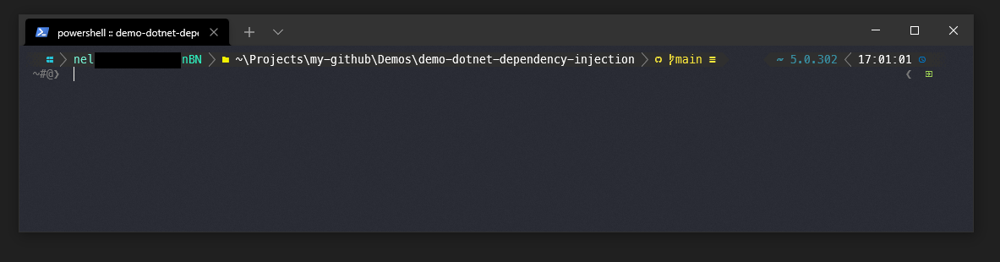
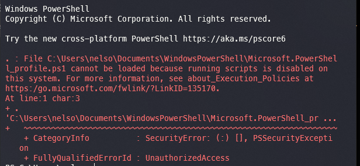

# Windows Terminal
Windows terminal is a new Microsoft open source CLI with support to multiple terminals like a command prompt, PowerShell, git CLI, Azure Cloud Shell, etc...


## Index
- [.. Tools](./README.md)
- [Donwload](#donwload)
- [Customization](#customization)
  - [Solve problems](#solve-problems)


## Download <a name="download"></a>
[Official](https://docs.microsoft.com/en-us/windows/terminal/get-started)


## Customization <a name="customization"></a>



**Install git support**
```bash
Install-Module posh-git -Scope CurrentUser -Force
```

**Install support for themes**
```bash
Install-Module oh-my-posh -Scope CurrentUser
```

**Install support terminal icons**
```bash
Install-Module -Name Terminal-Icons -Repository PSGallery
```


**Edit profile**
```bash
code $PROFILE
```

**Load modules and theme. Add next code in end of file**
```bash
Import-Module Terminal-Icons
Import-Module posh-git
Import-Module oh-my-posh
Set-PoshPrompt -Theme slimfat
```

**Install font to support theme icons**

Install the fronts for all users. Choose a font based in nerd fonts.


- **Font suggestion 1:** [CaskaydiaCove Nerd Font](https://github.com/ryanoasis/nerd-fonts/releases/download/v2.1.0/CascadiaCode.zip)
- **Font suggestion 2:** [MesloLGS NF](https://github.com/romkatv/dotfiles-public/tree/master/.local/share/fonts/NerdFonts)
- **More nerd fonts:** [Website](https://www.nerdfonts.com/)

**Settings > Open JSON file**
```json
"profiles":
{
  "defaults":
  {
    "acrylicOpacity": 0.89,
    "colorScheme": "Dracula",
    //"fontFace": "MesloLGS NF",
    "fontFace": "CaskaydiaCove Nerd Font",
    "fontSize": 10,
    "useAcrylic": true
  },

    ...

"schemes":
[
  {
    "name": "Dracula",
    "cursorColor": "#F8F8F2",
    "selectionBackground": "#44475A",
    "background": "#282A36",
    "foreground": "#F8F8F2",
    "black": "#21222C",
    "blue": "#BD93F9",
    "cyan": "#8BE9FD",
    "green": "#50FA7B",
    "purple": "#FF79C6",
    "red": "#FF5555",
    "white": "#F8F8F2",
    "yellow": "#F1FA8C",
    "brightBlack": "#6272A4",
    "brightBlue": "#D6ACFF",
    "brightCyan": "#A4FFFF",
    "brightGreen": "#69FF94",
    "brightPurple": "#FF92DF",
    "brightRed": "#FF6E6E",
    "brightWhite": "#FFFFFF",
    "brightYellow": "#FFFFA5"
  }
],
```

[Colors scheme](https://draculatheme.com/windows-terminal)


### Solve problems <a name="solve-problems"></a>

#### UnauthorizedAccess error


```bash
Set-ExecutionPolicy -ExecutionPolicy RemoteSigned -Scope CurrentUser
```

[Official documentation](https://docs.microsoft.com/en-us/powershell/module/microsoft.powershell.core/about/about_execution_policies?view=powershell-7.1)